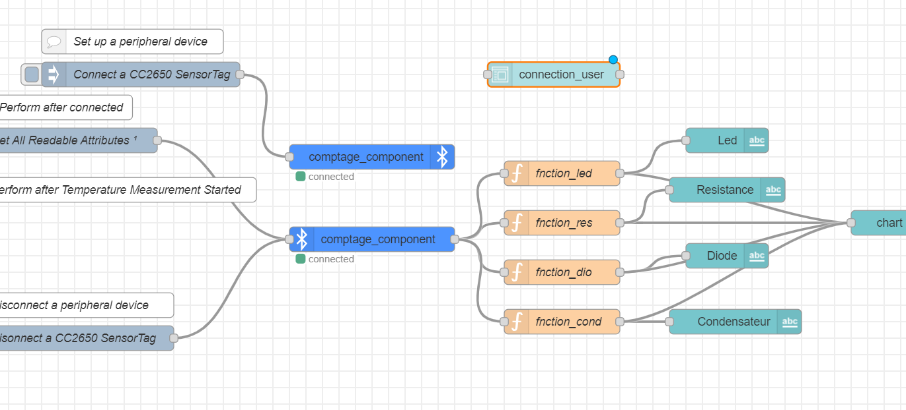

# Projet_B_reconnaissance-&-comptage-des-composants
## DEscription
Le but de ce projet est de créer un système capable de compter des composants électroniques en se basant sur la reconnaissance et la classification d'images. Les composants à compter sont placés sur un espace de travail et défilent individuellement toutes les deux secondes (ici leur déplacement se fait manuellement). Le système effectue la reconnaissance grâce à un modèle de Deep Learning entraîné préalablement avec Edge Impulse.

## Etapes de réalisation
### Création du modèle sur Edge impulse
   * 1e étape: Upload Dataset
     comme donnée ici j'ai logiquement utilisé les images des composants(prise d'une camera de plus grande qualité) et j'ai également pris quelques images avec la caméra OV afin que mon modèle puisse également se baser sur les images prises par la caméra qui sera au final utilisé, malgré qu'elle soit de très mauvaise qualité.
     
   * 2e étape: Create Impulse
     comme bloc d'apprentissage j'ai choisi Transfer learning (image)
   *  3e étape: Extract Features
      j'ai choici une couleur RVB
  * 4e étape: Entrainement du modèle
* 
    j'ai plutôt obtenu un bon score de 0.95, cependant le modèle est un peu lourd en terme de ressources memoires
  * Deploiement du modèle
    [code](nano_ble33_sense_camera)

  ### connexion Bluetooth arduino sense -----> Node-red

    [BLE_Node-red](test_connecxion-BLE/test_connecxion-BLE.ino)
  
     * schema dashbord connexion
  
    

  ### Interface Node-red
    * l'interface est constitué de deux onglets dont un pour la connection de l'utilisateur et l'autre pour le visuel du comptage des composants
 
    *  
    *   
